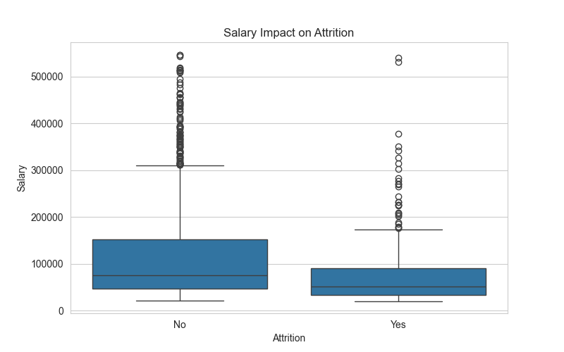
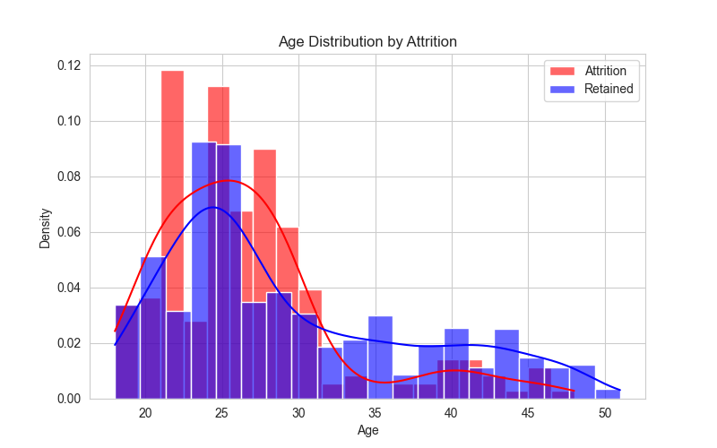
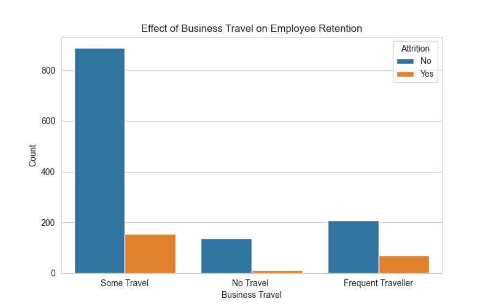
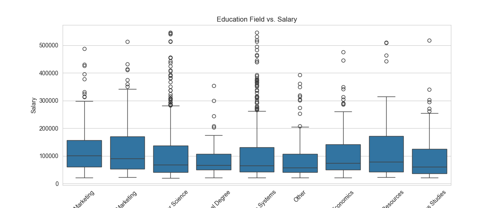

# Human Resources Dataset Analysis Project (DEPI)

This project explores employee performance, satisfaction levels, and their correlation with factors such as education, work-life balance, and training. By leveraging data analytics, we aim to derive actionable insights to improve workforce management.

## 👥 Team Members
- **Abdelrahman Mohamed Ibrahim**
- **Ahmed Abdelazeem Ahmed**
- **Eslam Fadl Sayed**
- **Mohamed Mostafa Mohamed**
- **Yousef Mohamed Hussein**

## 📊 Key Insights & Visualizations

Here are some of the key findings from our exploratory data analysis:

### 1. Salary Impact on Attrition
Analysis shows a significant difference in salary distribution between employees who left and those who stayed.


### 2. Age Distribution & Attrition
Understanding which age groups are most likely to leave the company helps in targeted retention strategies.


### 3. Business Travel Effect
Does frequent travel lead to higher attrition? The data reveals interesting trends.


### 4. Education Field vs. Salary
How education background influences compensation across different roles.


---

## 🎯 Objectives
1.  **Analyze Performance:** Investigate employee performance ratings and influencing factors.
2.  **Identify Trends:** Uncover patterns in job satisfaction and employee attrition.
3.  **Correlate Factors:** Study the relationship between education levels and performance.
4.  **Provide Insights:** Deliver actionable recommendations for HR decision-making using Python and Power BI.

## 📂 Project Structure

The project follows a standard data science project structure:

```
├── data/
│   ├── raw/             # Original datasets (Employee.csv, etc.)
│   ├── processed/       # Cleaned and preprocessed data
│   └── metadata/        # Data dictionaries and project metadata
├── src/
│   ├── data_cleaning.py      # Script for data cleaning and preprocessing
│   ├── analysis_questions.py # Script for answering key business questions
│   ├── eda_analysis.py       # Exploratory Data Analysis script
│   └── exploratory_plots.py  # Script for generating all visualizations
├── reports/
│   ├── figures/         # Generated plots and visualizations
│   ├── dashboard/       # Power BI Dashboard (.pbix)
│   └── docs/            # Project reports and documentation
├── README.md            # Project overview and instructions
└── requirements.txt     # Python dependencies
```

---

## 🛠 Prerequisites & Installation

Ensure you have Python installed. You can install the required libraries using:

```bash
pip install -r requirements.txt
```

## 🚀 How to Run

1.  **Data Cleaning:**
    Run the cleaning script to generate the processed dataset:
    ```bash
    python src/data_cleaning.py
    ```

2.  **Exploratory Data Analysis (EDA):**
    Run the EDA script to generate visualizations in `reports/figures/`:
    ```bash
    python src/eda_analysis.py
    ```

## 🧰 Tools Used
- **Python:** Pandas, Matplotlib, Seaborn (Data Processing & Visualization)
- **Power BI:** Interactive Dashboarding
- **Excel:** Preliminary Data Inspection
